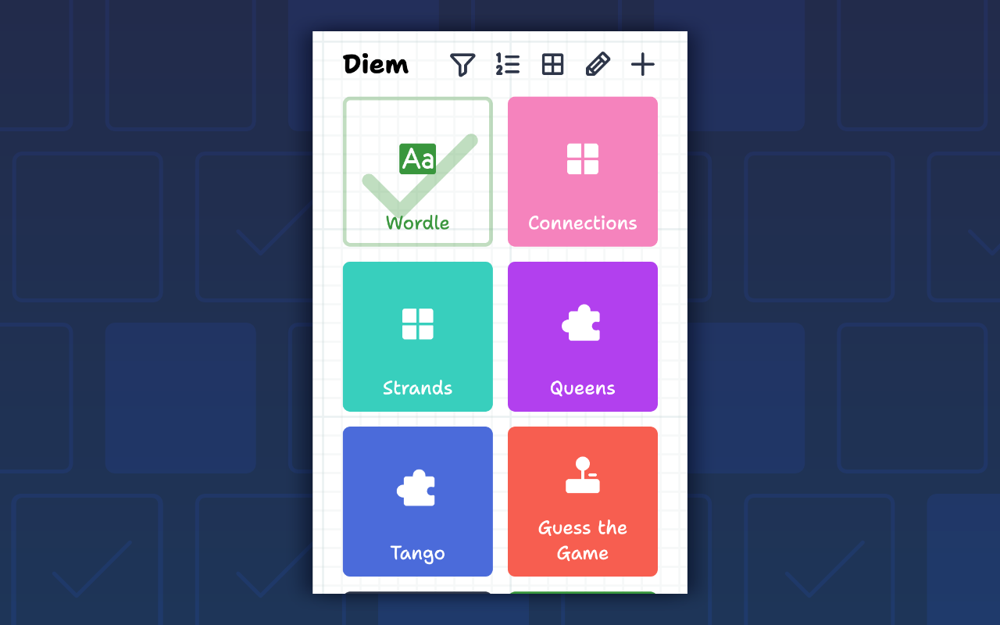
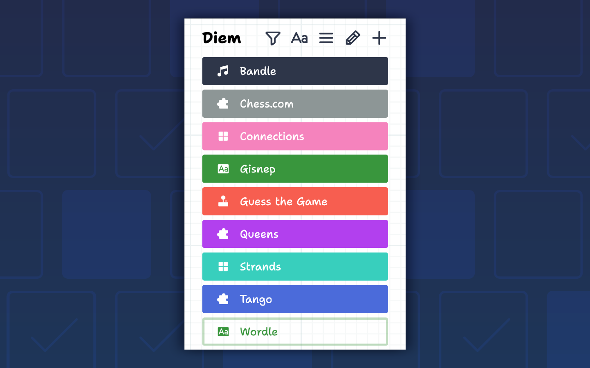
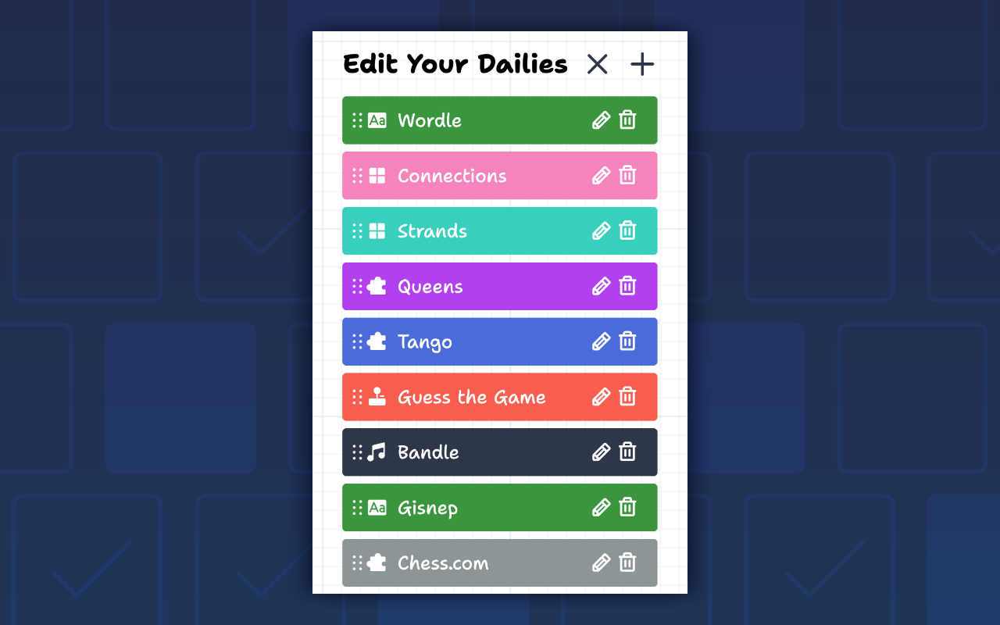
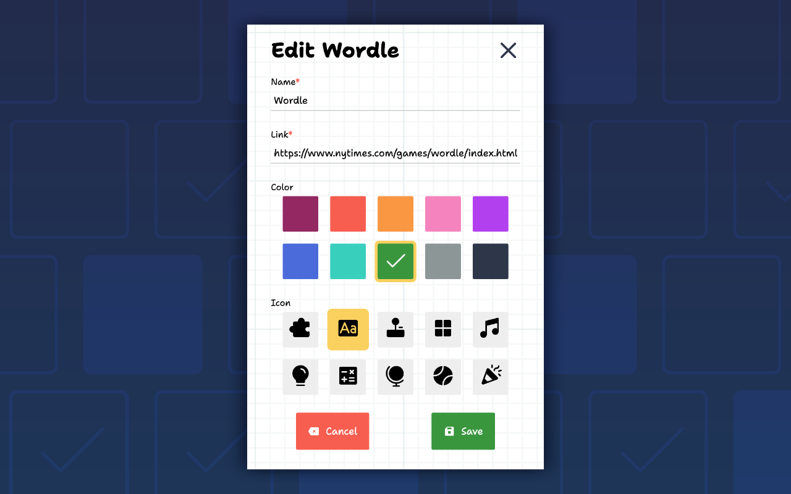

# Diem | Dailies Browser Extension

    

    A browser extension for listing and tracking your daily games (like 
    <a href="https://www.nytimes.com/games/wordle/index.html">
        Wordle</a>, 
    <a href="https://www.nytimes.com/games/wordle/index.html">
    Queens</a>, and 
    <a href="https://www.nytimes.com/games/wordle/index.html">
    Flagle</a>).

    Diem supports both a Popup and Side Panel view. We've added some defaults to get you started as well.

## Features
- Create a collection of daily game links, all in one place.
  - The link is automatically pulled from your current tab
- Automatically tick dailies off for the day when you visit to keep track.
- Filter out your completed dailies
- Sort your dailies by...
  - Custom Order *settable in the edit view*
  - Alphabetical order
  - Color
  - Icon
- Swap between a Grid and List view for your daily items.

## Screenshots

    

    

    

    

